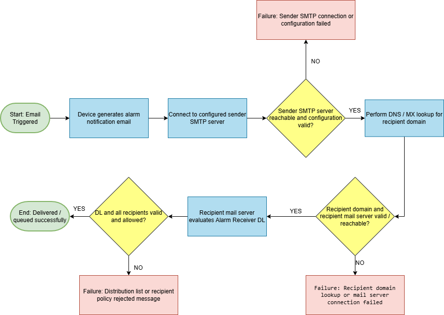

# SMTP Email Flow & Troubleshooting Guide

This project demonstrates end-to-end SMTP email flow along with structured troubleshooting methods used in real-world technical support scenarios.

---

## 📌 Project Overview

This repository explains how emails are sent using SMTP and how to diagnose issues when email delivery fails.

It covers:
- Email delivery flow
- Failure points
- Troubleshooting methodology
- Automation using PowerShell scripts

---

## 📧 What is SMTP?

SMTP (Simple Mail Transfer Protocol) is used to send emails from an application or client to a mail server and then to the recipient’s mail server.

---

## 🏢 Example Scenario

A system sends email notifications to:
- Internal users
- External users
- Distribution lists

Issues may occur at different stages such as application, SMTP server, network, DNS, or recipient side.

---

## ✅ Successful Email Flow

    [Application / System]
              ↓
       Email Triggered
              ↓
         [SMTP Server]
              ↓
      DNS / MX Lookup
              ↓
    [Recipient Mail Server]
              ↓
    [Inbox / Spam / Quarantine]

---

## 🔍 Step-by-Step Flow

### 1. Email is triggered
The application generates an email based on an event such as an alert or user action.

### 2. Application sends request to SMTP server
The application connects using SMTP server address, port, and credentials.

### 3. SMTP server validates the request
The server checks authentication, sender permissions, and relay access.

### 4. DNS / MX lookup happens
The server finds the recipient domain’s mail server using DNS.

### 5. Email is routed to recipient mail server
The message is sent to the destination mail server.

### 6. Recipient server processes the email
The server applies spam filters and security checks.

### 7. Email is delivered
The email is delivered to inbox, spam, quarantine, or rejected.

---

## ❌ Common Failure Scenarios

| Issue | Possible Cause | What to Check |
|------|--------------|--------------|
| Email not triggered | Application issue | Application logs |
| SMTP authentication failed | Wrong credentials | SMTP settings |
| Relay denied | Sender not allowed | SMTP relay rules |
| Email bounced | Invalid recipient | Email address |
| Email delayed | Queue issue | SMTP queue |
| Email in spam | Missing SPF/DKIM/DMARC | DNS records |
| External users not receiving | Firewall/mail rules | Network settings |

---

## 🛠 Troubleshooting Approach

Always troubleshoot in this order:

Application → SMTP Server → Network → DNS → Recipient

---

## 📂 Repository Structure

- diagrams/ → SMTP flow diagram  
- docs/ → Detailed troubleshooting guide  
- scripts/ → PowerShell troubleshooting scripts  

---

## 📊 SMTP Flow Diagram

---

## 📘 Detailed Troubleshooting Guide

Refer to the full guide here:  
➡️ [SMTP Troubleshooting Guide](./docs/troubleshooting-guide.md)

---

## ⚙️ Troubleshooting Scripts

This repository includes PowerShell scripts to identify issues across different layers:

### 🔹 Sender Side Check
➡️ [test-sender-side.ps1](./scripts/test-sender-side.ps1)  
Checks:
- Internet connectivity  
- IP configuration  
- DNS settings  
- Firewall status  

---

### 🔹 SMTP Server Check
➡️ [test-smtp-server.ps1](./scripts/test-smtp-server.ps1)  
Checks:
- SMTP server DNS resolution  
- Port connectivity (25, 465, 587)  

---

### 🔹 Domain / DNS Check
➡️ [test-domain-mx-records.ps1](./scripts/test-domain-mx-records.ps1)  
Checks:
- MX records  
- SPF records  
- DMARC configuration  

---

### 🔹 Recipient Side Check
➡️ [test-recipient-side.ps1](./scripts/test-recipient-side.ps1)  
Checks:
- Recipient domain  
- DNS records  
- Basic validation steps  

---

### 🔹 Full Email Flow Check
➡️ [test-full-email-flow.ps1](./scripts/test-full-email-flow.ps1)  
Runs all checks:
- Sender  
- SMTP server  
- Domain  
- Recipient  

---

## ▶️ How to Run Scripts

1. Open PowerShell  
2. Navigate to scripts folder:

   cd scripts

3. Run a script:

   .\test-full-email-flow.ps1

---

## 📚 Key Learnings

- Email issues can occur at multiple layers  
- Logs are critical for troubleshooting  
- Network and firewall issues are common  
- DNS plays a major role in email delivery  

---

## 🎯 Skills Demonstrated

- Technical troubleshooting  
- Root cause analysis  
- SMTP and email systems understanding  
- DNS and network diagnostics  
- PowerShell scripting  
- Documentation skills  
